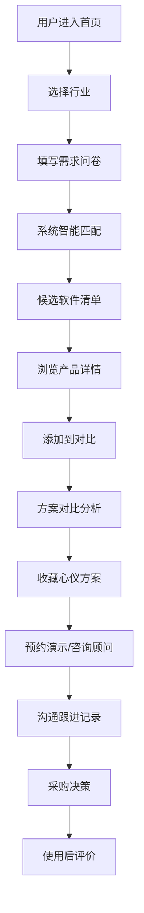

## 1. 产品概述

SaaS 选型平台是一个垂直行业门店经营软件选型与对比服务平台，聚焦餐饮、教育、医疗、美业四大行业。通过需求问卷匹配、产品库筛选、多方案对比、顾问咨询等功能，帮助商家快速找到最适合的门店经营软件，同时为软件服务商提供精准获客渠道。

## 2. 核心功能

### 2.1 用户角色

| 角色 | 注册方式 | 核心权限 |
|------|----------|----------|
| 商家用户 | 手机号注册 | 浏览产品、问卷匹配、方案对比、收藏方案、预约演示、沟通记录、产品评价 |
| 顾问 | 后台审核入驻 | 查看线索、回复咨询、记录沟通进度 |
| 服务商 | 企业认证入驻 | 维护产品资料、上传案例、回复咨询、查看数据统计 |
| 管理员 | 后台登录 | 平台管理、内容审核、用户管理 |

### 2.2 功能模块

1. **行业首页**：行业概览、热门软件推荐、选型指南、成功案例
2. **需求匹配问卷**：行业选择、门店规模、预算区间、核心需求、智能推荐
3. **产品库**：产品列表、多维筛选（价格/口碑/功能/售后）、产品详情、功能对比
4. **方案对比**：最多4款产品横向对比、功能覆盖雷达图、价格对比表
5. **顾问线索**：顾问列表、预约咨询、沟通记录、进度追踪
6. **商家后台**：我的收藏、预约管理、沟通记录、我的评价、个人资料
7. **服务商后台**：产品管理、案例管理、咨询管理、数据统计、企业资料

### 2.3 页面详情

| 页面名称 | 模块名称 | 功能描述 |
|----------|----------|----------|
| 行业首页 | Hero 区域 | 行业切换、搜索框、核心价值主张 |
| 行业首页 | 热门软件 | 按行业展示 TOP 推荐软件卡片 |
| 行业首页 | 选型流程 | 4步选型法图文介绍 |
| 行业首页 | 成功案例 | 客户使用案例展示 |
| 需求问卷 | 行业选择 | 餐饮/教育/医疗/美业 四大行业选择 |
| 需求问卷 | 门店规模 | 门店数量、员工规模选择 |
| 需求问卷 | 预算区间 | 月均预算滑块选择 |
| 需求问卷 | 核心需求 | 收银/会员/库存/预约/营销等多选 |
| 需求问卷 | 推荐结果 | 匹配度排序的软件清单 |
| 产品库 | 筛选侧边栏 | 价格、口碑、功能、售后范围筛选 |
| 产品库 | 产品列表 | 卡片式展示，支持排序切换 |
| 产品库 | 产品详情 | 功能介绍、价格方案、客户评价、案例展示 |
| 方案对比 | 对比栏 | 添加/移除对比产品 |
| 方案对比 | 对比表格 | 功能、价格、服务横向对比 |
| 方案对比 | 雷达图 | 功能覆盖度可视化对比 |
| 顾问线索 | 顾问列表 | 顾问卡片、擅长领域、评分 |
| 顾问线索 | 预约咨询 | 填写需求、预约时间 |
| 顾问线索 | 沟通记录 | 历史沟通记录、进度状态 |
| 商家后台 | 我的收藏 | 收藏的产品列表 |
| 商家后台 | 预约管理 | 演示预约、咨询预约 |
| 商家后台 | 我的评价 | 已购买产品的评价管理 |
| 服务商后台 | 产品管理 | 产品信息维护、功能配置 |
| 服务商后台 | 案例管理 | 客户案例上传编辑 |
| 服务商后台 | 咨询管理 | 查看咨询、回复跟进 |

## 3. 核心流程

### 3.1 商家选型主流程

用户进入平台 → 选择所属行业 → 填写需求问卷（门店数/预算/核心需求）→ 系统生成匹配清单 → 浏览产品详情 → 添加对比 → 方案对比分析 → 收藏心仪方案 → 预约演示/咨询顾问 → 沟通跟进 → 最终决策 → 使用后评价

### 3.2 流程图

### 3.3 服务商入驻流程

服务商注册 → 企业认证 → 完善资料 → 产品上架 → 案例上传 → 接收咨询 → 回复跟进 → 成单转化

## 4. 用户界面设计

### 4.1 设计风格

- **主色调**：深海蓝 (#0F52BA) - 代表专业、信任、科技
- **辅助色**：珊瑚橙 (#FF6B6B) - 代表活力、行动、温暖
- **中性色**：以 slate 色系为基础，营造专业商务感
- **按钮风格**：圆角 8px，悬浮有微缩放和阴影变化
- **字体**：标题使用 "Noto Serif SC" 衬线体增强品质感，正文使用 "Inter" 无衬线体保证可读性
- **布局风格**：卡片式布局，大量留白，层次分明
- **图标风格**：lucide-react 线性图标，统一 24px 尺寸

### 4.2 页面设计概览

| 页面名称 | 模块名称 | UI 元素 |
|----------|----------|---------|
| 行业首页 | Hero 区域 | 大标题+副标题，行业切换 Tab，搜索框，渐变背景 |
| 行业首页 | 热门软件 | 横向滚动卡片，评分展示，标签云 |
| 产品库 | 筛选侧边栏 | 折叠式筛选项，价格滑块，多选标签 |
| 产品详情 | 功能介绍 | 标签页切换，功能列表，价格方案卡片 |
| 方案对比 | 对比表格 | 固定表头，差异高亮，支持滚动 |
| 商家后台 | 数据概览 | 统计卡片，进度环形图，时间线 |

### 4.3 响应式设计

- 桌面端优先设计（1280px 以上）
- 平板端：侧边栏折叠，卡片两列布局
- 移动端：底部导航栏，单列布局，筛选抽屉
- 触摸优化：按钮最小 44px 高度，充足间距

### 4.4 动效设计

- 页面加载：元素渐入 + 轻微上移动画
- 卡片悬浮：上移 4px + 阴影加深
- 按钮交互：0.2s 过渡，颜色渐变
- 筛选展开：高度过渡动画
- 进度更新：数字递增动画
