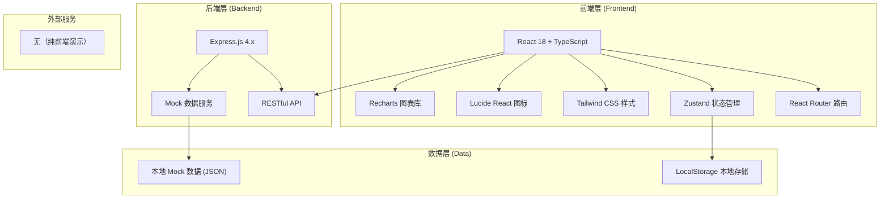
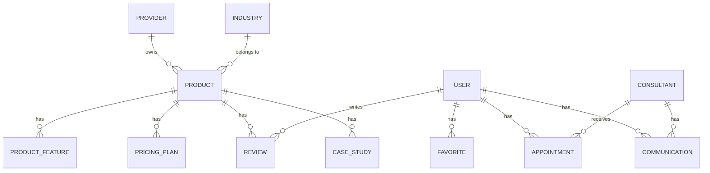

## 1. 架构设计



## 2. 技术描述

- **前端框架**：React 18 + TypeScript
- **构建工具**：Vite 5.x
- **路由管理**：React Router DOM 6.x
- **状态管理**：Zustand 4.x
- **样式方案**：Tailwind CSS 3.x
- **图标库**：Lucide React
- **图表库**：Recharts（雷达图、柱状图等）
- **后端框架**：Express.js 4.x（提供 Mock API）
- **数据库**：无（使用 JSON Mock 数据 + LocalStorage）
- **项目模板**：react-express-ts

## 3. 路由定义

| 路由路径 | 页面名称 | 说明 |
|----------|----------|------|
| `/` | 行业首页 | 平台首页，行业切换，热门推荐 |
| `/questionnaire` | 需求匹配问卷 | 多步骤问卷，智能推荐 |
| `/products` | 产品库 | 产品列表 + 筛选 |
| `/products/:id` | 产品详情 | 产品详细信息 |
| `/compare` | 方案对比 | 多产品横向对比 |
| `/consultants` | 顾问列表 | 顾问展示、预约入口 |
| `/dashboard` | 商家后台首页 | 数据概览、快捷入口 |
| `/dashboard/favorites` | 我的收藏 | 收藏产品管理 |
| `/dashboard/appointments` | 预约管理 | 演示/咨询预约 |
| `/dashboard/communications` | 沟通记录 | 历史沟通跟进 |
| `/dashboard/reviews` | 我的评价 | 产品评价管理 |
| `/provider` | 服务商后台首页 | 数据统计概览 |
| `/provider/products` | 产品管理 | 产品信息维护 |
| `/provider/cases` | 案例管理 | 客户案例管理 |
| `/provider/inquiries` | 咨询管理 | 咨询回复跟进 |
| `/login` | 用户登录 | 商家/顾问/服务商登录 |

## 4. 数据模型

### 4.1 核心数据实体



### 4.2 数据实体说明

**Product (产品)**
- id: string
- name: string
- logo: string
- providerId: string
- industry: string (餐饮/教育/医疗/美业)
- rating: number
- reviewCount: number
- priceMin: number
- priceMax: number
- priceUnit: string
- features: string[]
- description: string
- highlights: string[]
- afterSaleScope: string[]
- createdAt: string

**ProductFeature (产品功能)**
- id: string
- productId: string
- category: string (收银/会员/库存/预约/营销/报表等)
- name: string
- description: string
- hasFeature: boolean

**PricingPlan (价格方案)**
- id: string
- productId: string
- name: string
- price: number
- unit: string
- features: string[]
- recommended: boolean

**Review (评价)**
- id: string
- productId: string
- userId: string
- userName: string
- rating: number
- content: string
- createdAt: string

**CaseStudy (案例)**
- id: string
- productId: string
- title: string
- clientName: string
- industry: string
- description: string
- results: string[]
- image: string

**Provider (服务商)**
- id: string
- name: string
- logo: string
- description: string
- website: string
- contactInfo: object

**User (用户)**
- id: string
- name: string
- phone: string
- email: string
- role: string (merchant/consultant/provider)
- company: string

**Favorite (收藏)**
- id: string
- userId: string
- productId: string
- createdAt: string

**Appointment (预约)**
- id: string
- userId: string
- productId: string
- consultantId: string
- type: string (demo/consultation)
- date: string
- time: string
- status: string (pending/confirmed/completed/cancelled)
- notes: string
- createdAt: string

**Communication (沟通记录)**
- id: string
- appointmentId: string
- userId: string
- consultantId: string
- content: string
- type: string (note/call/email)
- createdAt: string

**QuestionnaireResult (问卷结果)**
- id: string
- userId: string
- industry: string
- storeCount: number
- budget: number
- coreNeeds: string[]
- matchedProducts: string[]
- createdAt: string

## 5. 项目目录结构

```
/
├── src/                          # 前端源码
│   ├── components/               # 公共组件
│   │   ├── layout/              # 布局组件
│   │   ├── ui/                  # UI 基础组件
│   │   └── cards/               # 卡片组件
│   ├── pages/                   # 页面组件
│   │   ├── home/                # 首页
│   │   ├── questionnaire/       # 问卷页
│   │   ├── products/            # 产品库
│   │   ├── compare/             # 方案对比
│   │   ├── consultants/         # 顾问列表
│   │   ├── dashboard/           # 商家后台
│   │   └── provider/            # 服务商后台
│   ├── store/                   # Zustand 状态
│   ├── data/                    # Mock 数据
│   ├── types/                   # TypeScript 类型
│   ├── utils/                   # 工具函数
│   ├── hooks/                   # 自定义 Hooks
│   ├── App.tsx
│   ├── main.tsx
│   └── index.css
├── api/                         # 后端源码
│   ├── routes/                  # 路由
│   ├── data/                    # Mock 数据
│   └── index.ts
├── .trae/
│   └── documents/               # 项目文档
├── package.json
├── vite.config.ts
├── tailwind.config.js
├── tsconfig.json
└── README.md
```
